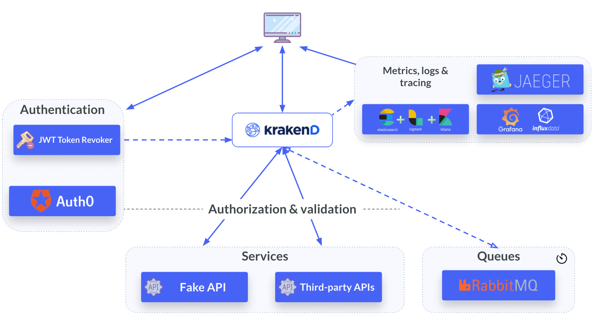

# 🔗 API Gateway - KrakenD

This is a test repository utilizing KrakenD, a high-performance, open-source API Gateway designed to simplify the integration, orchestration, and delivery of APIs in microservices architectures.

This repository contains a simple application with a basic front-end and back-end. The front-end communicates directly with the API Gateway, which handles requests and forwards them to the respective microservices responsible for executing the required actions.

Below, you will find an illustrative image demonstrating how KrakenD works.

Learn more: https://www.krakend.io/